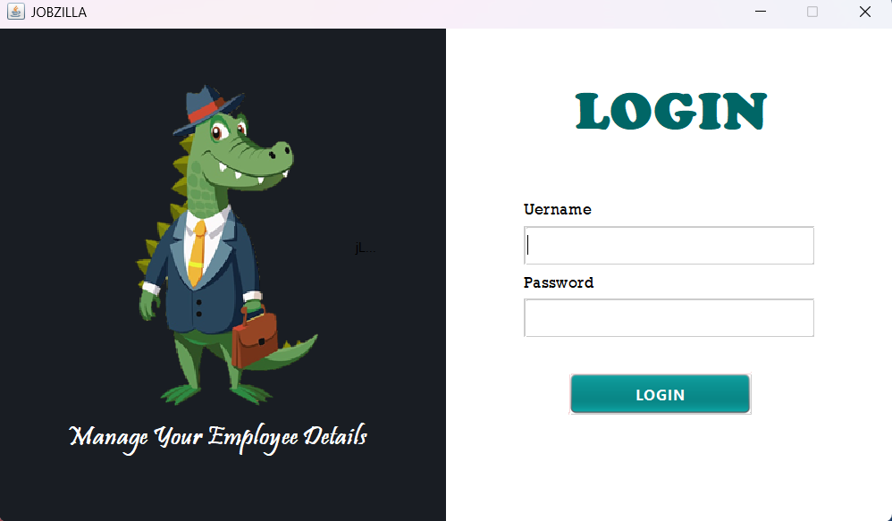
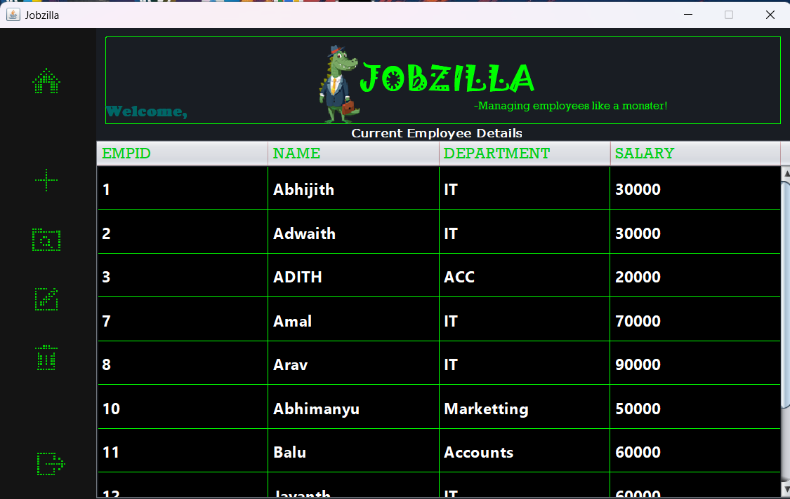
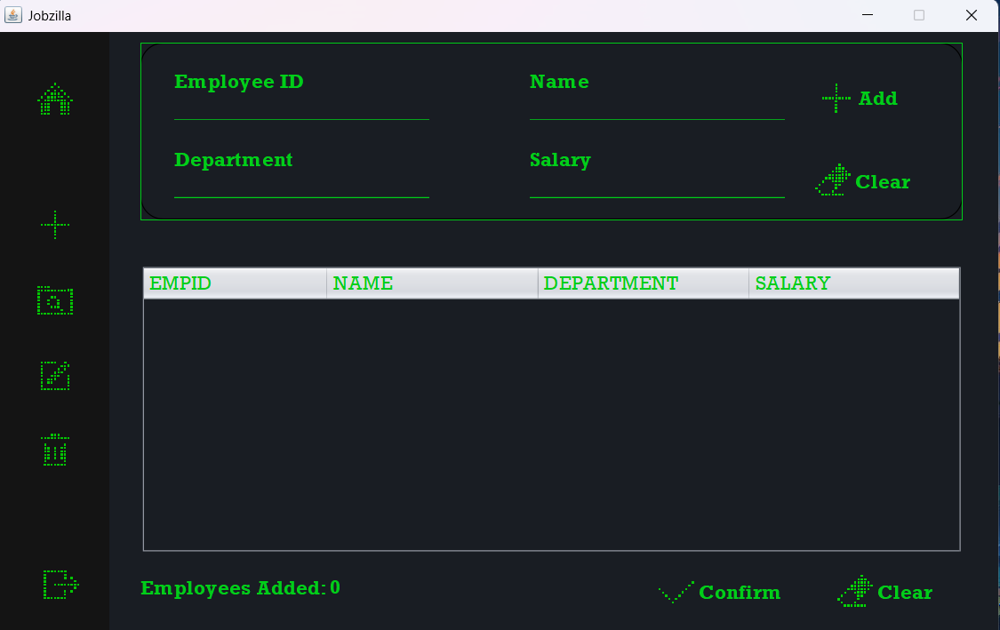
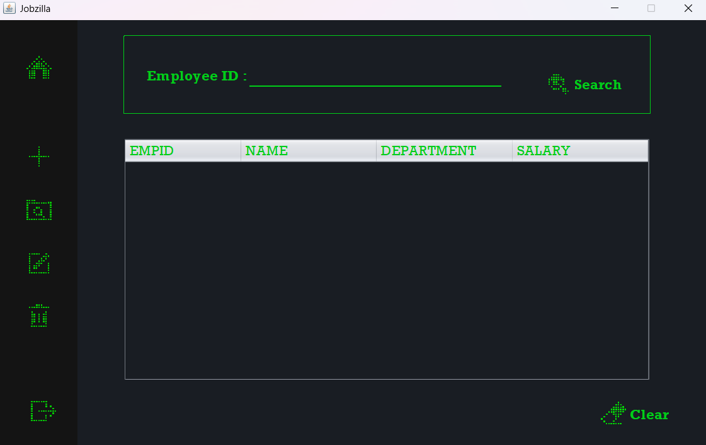
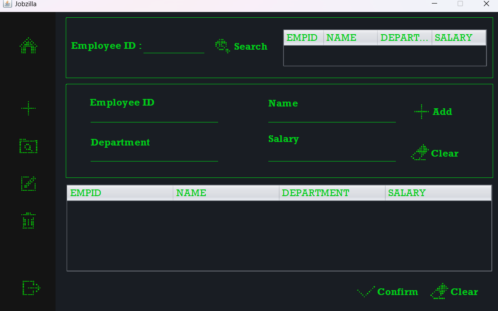

# 👨‍💼 Jobzilla - Employee Management System

Jobzilla is a simple and user-friendly **Employee Details Management App** built using **Java Swing** for the GUI and **JDBC** for database connectivity. It allows basic CRUD operations for managing employee records in an organization.

---

## 🖥️ Features

- 📝 Add New Employee
- 🔍 View All Employees
- ✏️ Update Employee Details
- ❌ Delete Employee Record
- 🔍 Search by Employee ID

Built entirely with:
- 🛠️ **Java Swing** for GUI
- 🗃️ **JDBC** for MySQL/Database connectivity

---

## 🖼️ Screenshots

### 🔐 Login Window

### 🏠 Main Dashboard

### ➕ Add Employee

### 🔍 View Employees

### ✏️ Update Record

### ✏️ Delete Record

---

